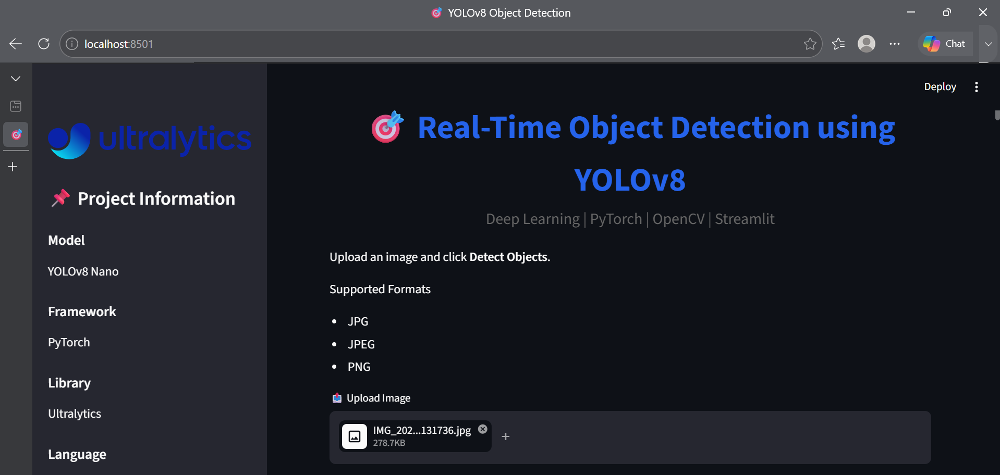
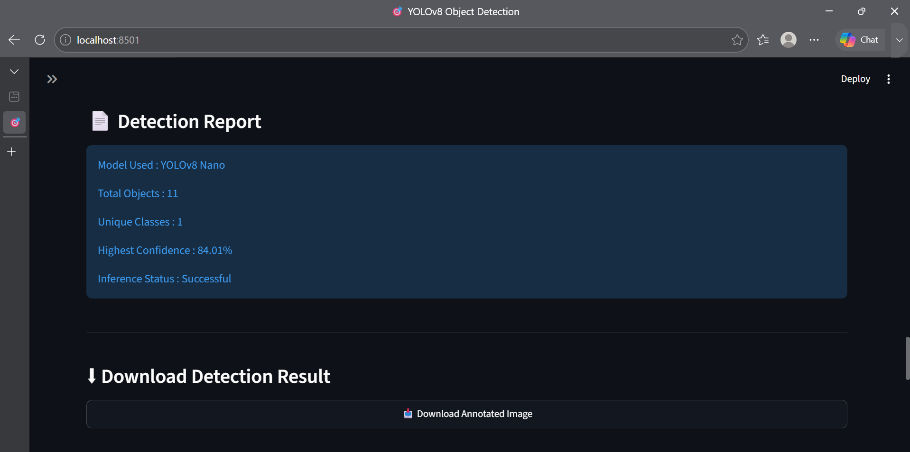
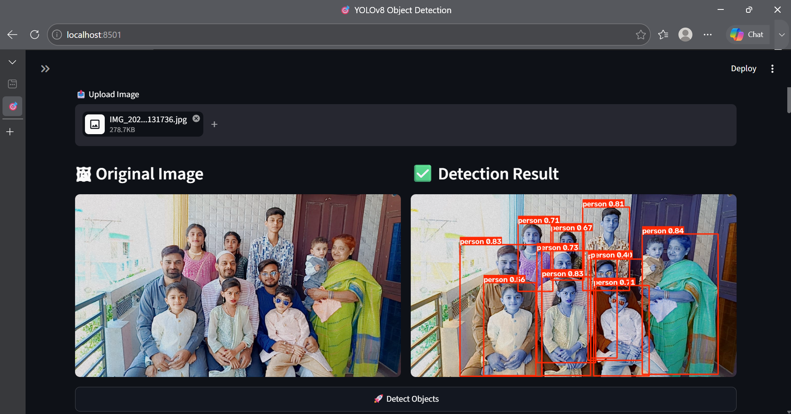
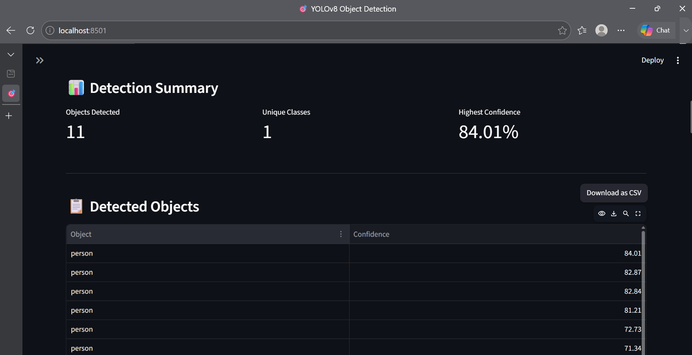

# 🎯 Real-Time Object Detection using YOLOv8

A deep learning-based real-time object detection web application built using **YOLOv8**, **PyTorch**, **OpenCV**, and **Streamlit**. The application detects multiple objects in uploaded images, displays bounding boxes with confidence scores, and provides interactive visualizations through a modern dashboard.

---

## 📌 Project Overview

This project demonstrates the implementation of a real-time object detection system using the pre-trained **YOLOv8 Nano** model from Ultralytics. Users can upload an image through a Streamlit web interface, and the application detects multiple objects, displays annotated results, confidence scores, detection statistics, and interactive charts.

---

## ✨ Features

- 📤 Upload Images (JPG, JPEG, PNG)
- 🎯 Real-Time Object Detection
- 🖼️ Original vs Detected Image Comparison
- 📊 Detection Summary Dashboard
- 📋 Object Detection Table
- 📈 Confidence Score Visualization
- 🥧 Object Distribution Pie Chart
- 📊 Object Count Bar Chart
- 📄 Detection Report
- 📥 Download Annotated Detection Image
- 💡 Detection Insights & Tips
- 🎨 Modern Streamlit User Interface

---

## 🛠️ Tech Stack

| Technology | Purpose |
|------------|---------|
| Python | Programming Language |
| YOLOv8 | Object Detection Model |
| PyTorch | Deep Learning Framework |
| OpenCV | Image Processing |
| Streamlit | Web Application |
| Pandas | Data Processing |
| Plotly | Interactive Charts |
| Pillow | Image Handling |

---

## 📂 Project Structure

```text
YOLOv8-Object-Detection/
│
├── images/
│   └── sample.jpg
│
├── models/
│   └── yolov8n.pt
│
├── notebooks/
│   └── YOLO_EDA.ipynb
│
├── screenshots/
│   ├── home.png
│   ├── report.png
│   ├── result.png
│   └── summary.png
│
├── app.py
├── detect.py
├── requirements.txt
├── README.md
├── LICENSE
├── .gitignore
└── .gitattributes
```

---

## 🚀 Installation

### Clone the Repository

```bash
git clone https://github.com/nayabyaseenkhan/YOLOv8-Object-Detection.git
```

### Navigate to the Project

```bash
cd YOLOv8-Object-Detection
```

### Create a Virtual Environment

```bash
python -m venv .venv
```

### Activate Virtual Environment

**Windows**

```powershell
.\.venv\Scripts\activate
```

**Linux / macOS**

```bash
source .venv/bin/activate
```

### Install Required Libraries

```bash
pip install -r requirements.txt
```

---

## ▶️ Run the Application

```bash
streamlit run app.py
```

The application will automatically open in your default browser.

---

## 🔄 Project Workflow

1. Upload an image.
2. Click **Detect Objects**.
3. YOLOv8 processes the image.
4. Objects are detected with bounding boxes.
5. Confidence scores are calculated.
6. Detection statistics are generated.
7. Charts visualize detected objects.
8. Download the annotated image.

---

## 🤖 Model Information

**Model:** YOLOv8 Nano (`yolov8n.pt`)

YOLOv8 is a state-of-the-art object detection model developed by **Ultralytics**. It performs real-time detection with high speed and accuracy while remaining lightweight enough for practical applications.

---

## 📸 Application Screenshots

### 🏠 Home Page



---

### 📄 Detection Report



---

### 🎯 Detection Result



---

### 📊 Detection Summary



---

## 💼 Real-World Applications

- 🚗 Autonomous Vehicles
- 🎥 Smart Surveillance
- 🤖 Robotics
- 🏭 Industrial Automation
- 🚦 Traffic Monitoring
- 🛒 Retail Analytics
- 📦 Inventory Management
- 🏙️ Smart City Solutions

---

## 📈 Future Enhancements

- 📷 Webcam Object Detection
- 🎥 Video Object Detection
- 🎯 Adjustable Confidence Threshold
- 🧠 Multiple YOLO Model Selection
- 📄 Export Detection Results as CSV
- ☁️ Cloud Deployment
- 📱 Mobile Responsive Interface

---

## 👨‍💻 Author

**Nayab Yaseen Khan**

Artificial Intelligence & Data Science Graduate

GitHub:
https://github.com/nayabyaseenkhan

---

## 📄 License

This project is licensed under the **MIT License**.

---

## ⭐ Support

If you found this project helpful, consider giving it a **⭐ Star** on GitHub.